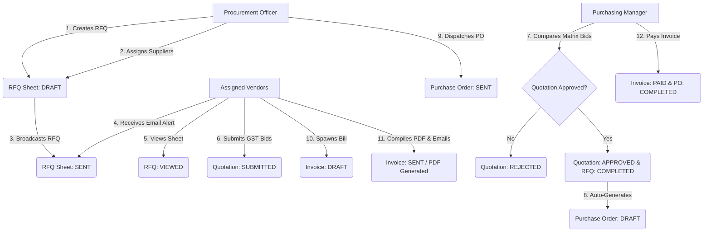
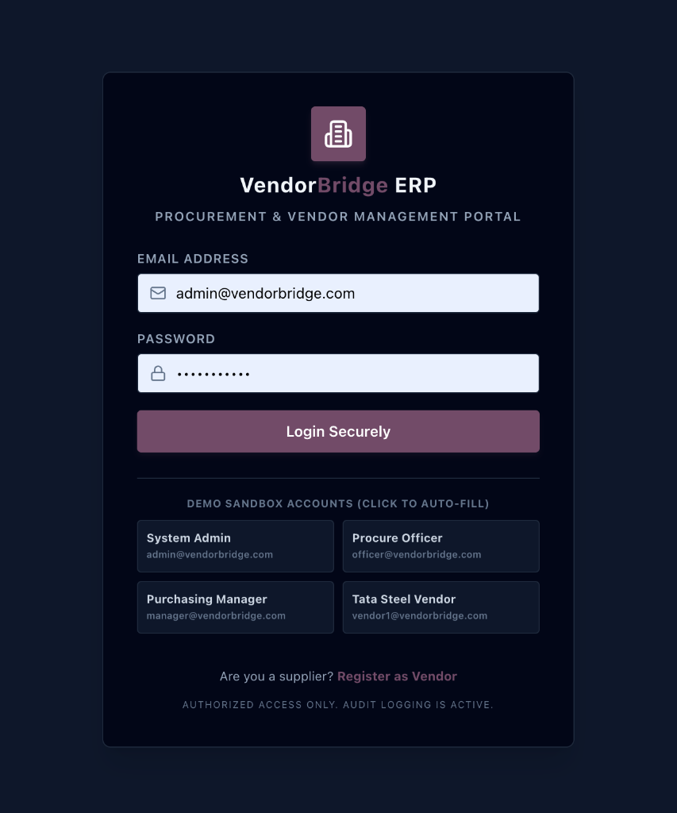
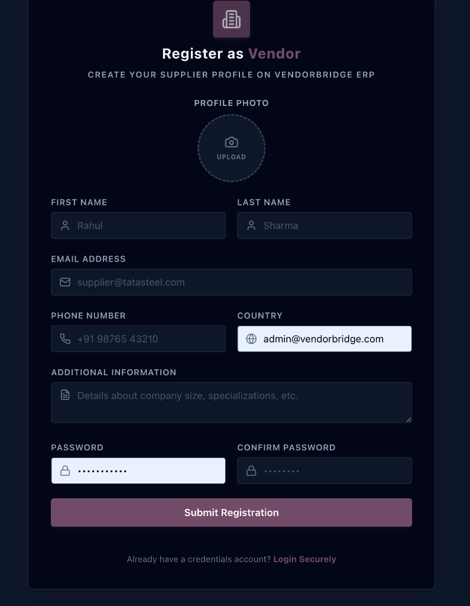
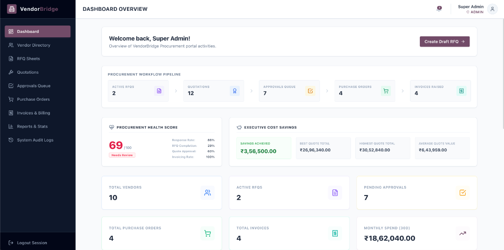
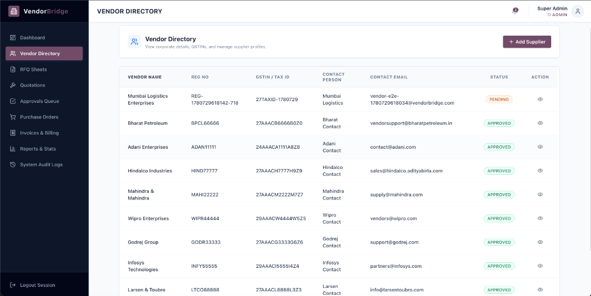
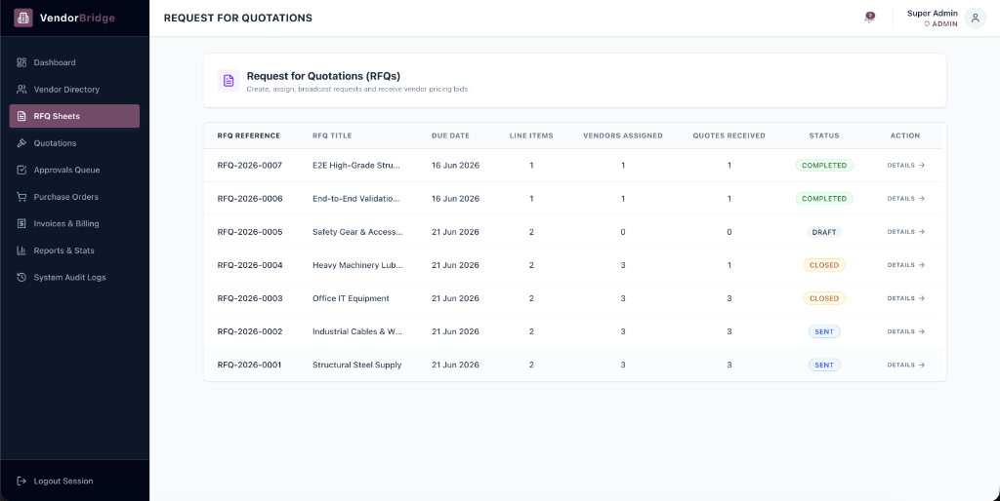

# VendorBridge ERP 🚀
### Full-Stack Procurement & Vendor Management ERP System

VendorBridge is a comprehensive, enterprise-ready **Procurement and Vendor Management ERP** built to optimize B2B supplier collaboration. It maps the full lifecycle of procurement—from registering vendors and broadcasting Request for Quotations (RFQs) to receiving tax-calculated bids, matrix comparisons, manager authorizations, Purchase Order (PO) dispatches, and PDF tax invoice generation.

The user interface adopts high-density, workflow-focused design guidelines inspired by **Odoo ERP** dashboards.

---

## 🏗️ Procurement Workflow Lifecycle

Below is the linear workflow sequence mapping the entire procurement pipeline:



---

## 🛠️ Tech Stack & Architecture

### Frontend (Client-side Portal)
* **Framework**: React 18, Vite, TypeScript
* **State & Data Fetching**: TanStack React Query (v5), Axios Interceptors (attaches JWT tokens)
* **Styling**: Tailwind CSS (Odoo ERP inspired high-density layouts, custom sidebar navigation, `<StatusBadge>` color codes, visual progress steppers)
* **Icons**: Lucide React

### Backend (REST API Server)
* **Runtime**: Node.js, Express.js (TypeScript compiled)
* **Database & ORM**: MySQL Database + Prisma ORM Client
* **Authentication**: JWT (JSON Web Tokens) with Role-Based Access Control (RBAC) middleware
* **Assets / Operations**:
  * **pdf-lib**: Generates tax-compliant PDFs from binary invoice states
  * **nodemailer**: Handles email notifications (dispatched when RFQs are broadcasted, POs sent, and invoices billed)
  * **multer**: Multipart disk storage for RFQ specification sheets

---

## 🔒 Demo Credentials & Sandbox Roles

The database contains dynamic demo records out of the box. All accounts share a unified password in the seed:

* **Unified Password**: `password123`

| Persona / Role | Email Account | System Privileges |
| :--- | :--- | :--- |
| **System Administrator** | `admin@vendorbridge.com` | Full visibility, reads activity logs, verifies vendor directories. |
| **Procurement Officer** | `officer@vendorbridge.com` | Creates RFQs, uploads specifications, assigns suppliers, dispatches POs. |
| **Purchasing Manager** | `manager@vendorbridge.com` | Accesses the approvals queue, reviews quotation matrices, authorizes purchases. |
| **Vendor (Tata Steel Rep)** | `vendor1@vendorbridge.com` | Views assigned RFQs, submits GST bids, raises PO invoices, compiles tax PDFs. |
| **Vendor (Reliance Rep)** | `vendor2@vendorbridge.com` | Same as Vendor 1 (linked to Reliance Industries). |
| **Vendor (L&T Rep)** | `vendor3@vendorbridge.com` | Same as Vendor 1 (linked to Larsen & Toubro). |

---

## 📦 Database Schema Summary

The MySQL database contains **16 relational tables** managed cleanly through Prisma ORM Client:

1. **Role**: RBAC roles (`ADMIN`, `PROCUREMENT_OFFICER`, `MANAGER`, `VENDOR`).
2. **User**: Credentials, hashed passwords, active states, and role links.
3. **Vendor**: Registration profiles, TAX IDs (GSTINs), approval statuses, and link to User logins.
4. **Rfq**: Request for Quotation headers (status, due date, creator).
5. **RfqItem**: Line items required (description, quantities, UOM, target pricing reference).
6. **RfqAttachment**: Specification files uploaded by Procurement Officers.
7. **RfqVendor**: Composite mapping link between RFQs and assigned Suppliers (Unique key: `uq_rfq_vendor`).
8. **Quotation**: Supplier quotation bids containing subtotal, CGST, SGST, IGST tax computations, validity, and status.
9. **QuotationItem**: Line-item unit rates, compliance notes, and lead times.
10. **Approval**: Authorization signatures containing manager feedback notes.
11. **PurchaseOrder**: Legal PO documents mapping approved bids.
12. **PurchaseOrderItem**: Quantities and unit pricing locked in from approved bids.
13. **Invoice**: Vendor bills mapping PO line items.
14. **InvoiceItem**: Quantities invoiced.
15. **Notification**: User-specific alerts.
16. **ActivityLog**: Centralized audit trails (logins, actions, entity types, IP tracking).

---

## 📡 API Endpoint Reference

All endpoints (except auth credentials) require an `Authorization: Bearer <JWT_TOKEN>` header.

### Authentication (`/auth`)
* `POST /auth/register` - Registers a new user account.
* `POST /auth/login` - Authenticates credentials and returns a JWT token.
* `POST /auth/logout` - Logs out the active user session and records an audit log.

### Vendor Directory (`/vendors`)
* `GET /vendors` - Lists all supplier profiles.
* `POST /vendors` - Creates a new supplier registration.
* `PATCH /vendors/:id/status` - Approves or rejects a supplier profile (Manager/Admin).

### Request for Quotations (`/rfqs`)
* `GET /rfqs` - Queries RFQ list (scoped dynamically by active role).
* `POST /rfqs` - Creates draft RFQ worksheet (Officer/Admin).
* `GET /rfqs/:id` - Detailed RFQ worksheet + progress steppers.
* `POST /rfqs/:id/assign` - Overwrites vendor assignments.
* `POST /rfqs/:id/send` - Broadcasts RFQ to suppliers (triggers email alerts).
* `POST /rfqs/:id/attachments` - Uploads PDF specs.

### Bids & Quotations (`/quotations`)
* `GET /quotations` - Lists quotations (vendors see their own, internal roles see all).
* `POST /quotations` - Submits a supplier bid (computes India GST).
* `GET /quotations/:id` - Retrieves a detailed quotation sheet.
* `GET /quotations/compare/:rfqId` - Side-by-side comparison matrix (highlights lowest item price in green).

### Purchase Orders (`/pos`)
* `GET /pos` - Queries PO directory.
* `GET /pos/:id` - Detailed PO card showing terms and linked invoices.
* `POST /pos/:id/send` - Dispatches PO to the supplier.

### Billing & Invoices (`/invoices`)
* `GET /invoices` - Lists invoices.
* `POST /invoices` - Vendor spawns a draft invoice from a sent PO.
* `GET /invoices/:id` - Detailed tax invoice showing CGST, SGST, or IGST breakdowns.
* `POST /invoices/:id/send-pdf` - Compiles PDF and sends to accounts (SMTP fallback logged in database).

### Analytics & Logs
* `GET /analytics/dashboard` - Computes overall KPI metrics and recent items list.
* `GET /analytics/reports` - Returns vendor performance metrics and monthly spend values.
* `GET /activity-logs` - System audit log records list (Admin only).

---

## 🚀 Installation & Local Execution

### 1. Prerequisite Database Configuration
Make sure **MySQL** is running on your machine on port `3306`. Create a database named `vendorbridge`:
```sql
CREATE DATABASE vendorbridge;
```

### 2. Configure Environment Variables
Inside the `backend/` folder, confirm the `.env` settings map your local MySQL database:
```env
DATABASE_URL="mysql://root:<YOUR_PASSWORD>@localhost:3306/vendorbridge"
PORT=5001
JWT_SECRET="super-secret-vendorbridge-jwt-token-key-2026"
```

Inside the `frontend/` folder, confirm the `.env` settings point to the backend server:
```env
VITE_API_URL=http://localhost:5001/api/v1
```

### 3. Install All Dependencies
Run the installation script at the root directory:
```bash
npm run install:all
```

### 4. Database Schema Migration & Seeding
Compile Prisma Client, apply the migrations, and run the idempotent seeding script:
```bash
# Generate Prisma Client & Migrate
cd backend
npx prisma generate
npx prisma migrate dev --name init

# Run Idempotent Database Seeding
npx prisma db seed
```

### 5. Launch the Application Dev Servers
Run the dev command at the root directory to start both client and API servers concurrently:
```bash
cd ..
npm run dev
```

* **Frontend Dashboard**: `http://localhost:5173/`
* **Backend API Base**: `http://localhost:5001/api/v1`

---

## 🛡️ Robust Fail-Safe Logic
1. **India GST Tax Engine**: Dynamically computes CGST (9%) and SGST (9%) when the supplier's state GSTIN matches Maharashtra (`27...`); otherwise, it applies IGST (18%).
2. **SMTP Fallback Handling**: If SMTP credentials are blank or fail, the system writes `EMAIL_SEND_FALLBACK` to the activity logs and resolves successfully, allowing the procurement workflow to continue.
3. **PDF Generation Fallback**: If PDF generation fails, the system logs `PDF_GEN_FALLBACK` and saves the database invoice with a `null` PDF path instead of crashing, keeping the system stable.
4. **Idempotent Seed**: Re-running the database seed script truncates old data in reverse-dependency order, resolving duplicate unique constraints.

---

# Application Screenshots

## Login & Authentication


*Caption: Secure login portal with role-based access control and quick-autofill cards for sandbox testing.*

---

## Vendor Registration


*Caption: Public vendor registration screen with input validations and supplier onboarding.*

---

## Dashboard Overview


*Caption: Odoo ERP-inspired high-density dashboard featuring pipeline status counters, dynamic cost savings, and procurement health scores.*

---

## Vendor Management


*Caption: Vendor directory directory showing approved and pending supplier details, tax IDs, and reg codes.*

---

## RFQ Sheets


*Caption: Sourcing dashboard showing all RFQ documents, statuses, and vendor assignments.*

---

## Demo Credentials

Admin:
admin@vendorbridge.com

Procurement Officer:
officer@vendorbridge.com

Manager:
manager@vendorbridge.com

Vendor:
vendor1@vendorbridge.com

Password:
password123


